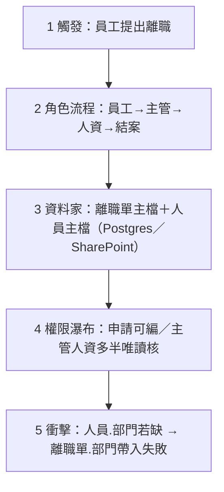
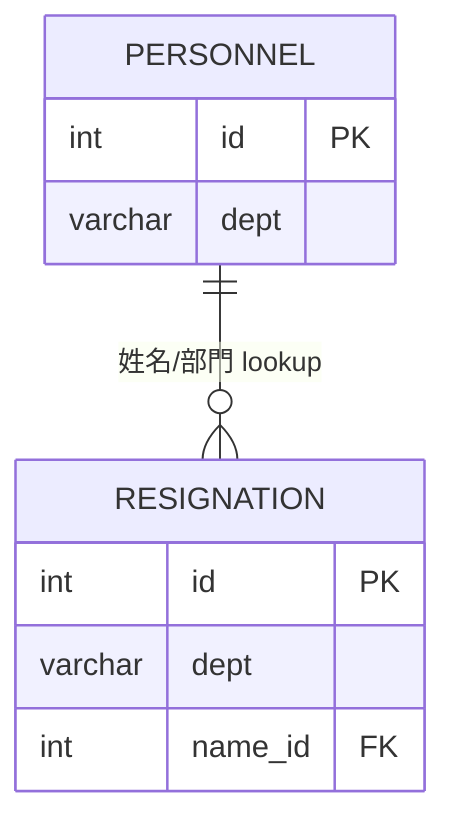
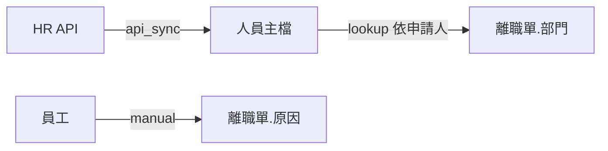
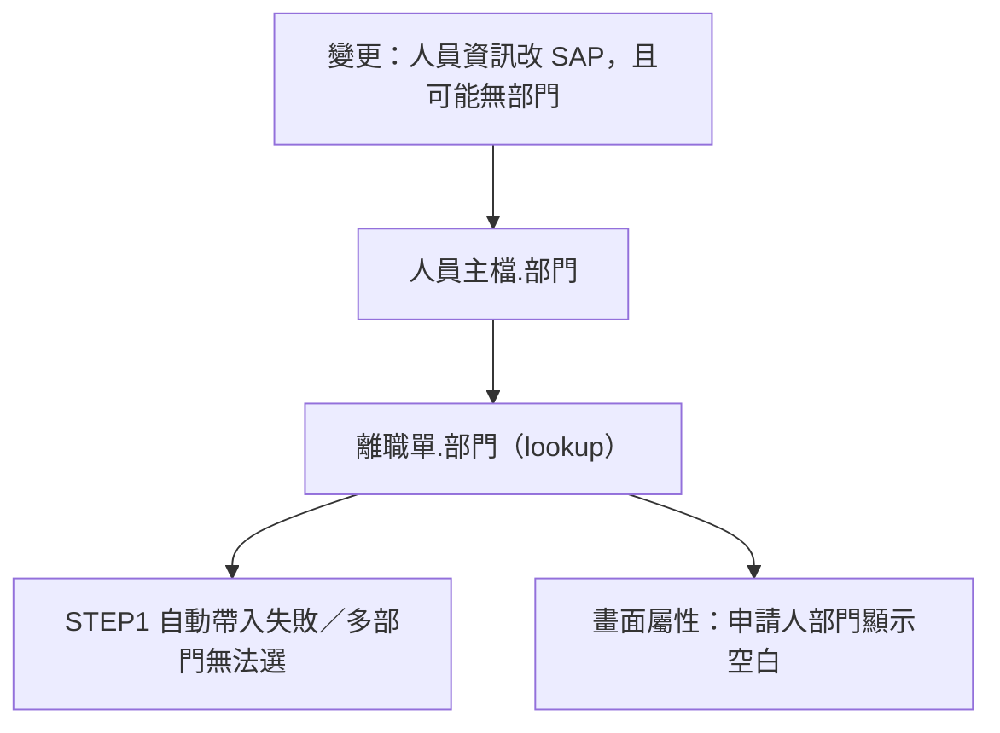

# 輸出視圖樣板（Agent 按需讀取）

## A. 整系統一眼圖（必出）

用 Mermaid `flowchart TB`，節點編號對 12345：

節點文字要換成該系統真實內容；3 必須點名「表＋存放處」。

## B. 故事流程圖

## C. 資料家（ER／血緣）

另可用 `flowchart` 標每個欄的 `source.kind`：

## D. 欄位權限瀑布（步驟 × 角色）

表格或 Mermaid 皆可。建議欄：步驟｜角色｜欄位｜可見｜可編｜必填｜用途。

瀑布語意：同一欄位從上到下「誰填 → 誰看不能改 → 誰核 → 誰用」。

| 步驟 | 角色 | 欄位 | 可見 | 可編 | 必填 |
|------|------|------|------|------|------|
| 1 填單 | 員工 | 姓名 | ✓ | ✓（僅自己） | ✓ |
| 2 主管 | 主管 | 姓名 | ✓ | ✗ | — |
| 3 人資 | 人資 | 姓名 | ✓ | ✗ | — |

## E. 變更衝擊圖

## F. 給完全不懂的人的白話一句

每份地圖結尾固定一句：

> 這系統就是：「誰」因為「什麼事」走「幾步」，中間把資料放在「哪幾張表」，每格資料「怎麼來、誰能動、後來誰用」。

## G. 互動模擬（角色 × 情境）

靜態網頁已自倉庫移除；若之後重建或在對話中模擬，仍遵守下列硬規則：

硬規則（使用者指定的空間記憶）：

- 所有欄位像城市地圖的地點／馬路，**座標固定**。
- 換角色、換情境時：**不准** `display:none`、不准重排 DOM 順序、不准讓格子「搬家」。
- 只允許改 paint（會改／只看／依賴／無關變淡／衝擊亮紅）。
- 右側說明要講「這個角色在這個情境會怎樣用這格」，不要只貼欄位定義。
