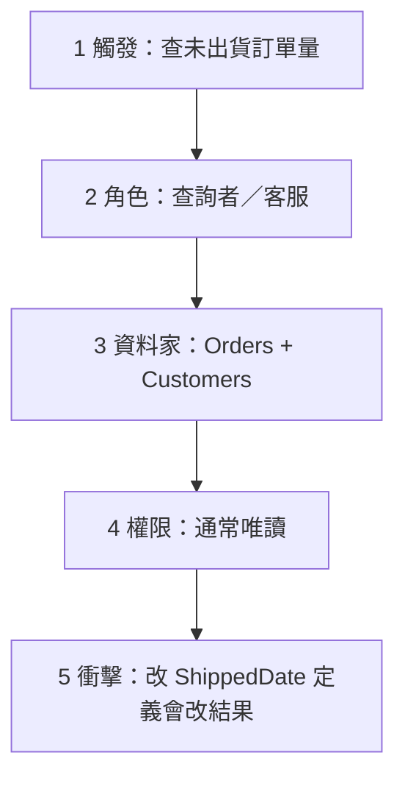

# 範例：SQL → 三種鏡片（對齊語氣）

假想使用者貼了：

```sql
SELECT c.CustomerName, COUNT(o.OrderId) AS OpenOrders
FROM Orders o
JOIN Customers c ON c.CustomerId = o.CustomerId
WHERE o.ShippedDate IS NULL
GROUP BY c.CustomerName
ORDER BY OpenOrders DESC;
```

並說：「幫我看懂」。

---

## 鏡片 `native`（預設，若像單純查詢）

**結論：** 列出每個客戶目前「還沒出貨」的訂單數，未出貨多的排前面。

- **類型** `sql`｜**鏡片** `native`
- **資料進出：** 讀 `Orders`＋`Customers`；不寫入。
- **篩選：** `ShippedDate IS NULL`＝尚未出貨。
- **彙總：** 依客戶名 `COUNT` 訂單。
- **雷：** 同名客戶會併成一列（若應用 `CustomerId` 分組較穩）。

要學生版或地圖跟我說即可。

---

## 鏡片 `student`

**結論：** 老師在問「誰家貨還沒寄？寄不出去的訂單有幾筆？」

- 兩張表：訂單、客戶（用客戶編號對起來）。
- 只留「出貨日空白」的訂單。
- 每個客戶算幾筆，多的排上面。
- 小考：若兩個客戶同名，這支 SQL 會怎樣？

---

## 鏡片 `map`（12345 縮寫）



- **3 主錨：** `Orders.CustomerId` → `Customers`；關鍵欄 `ShippedDate` 來源多半是出貨作業寫入。
- **5：** 若「取消單」也讓 `ShippedDate` 為空，未出貨數會被灌水。
